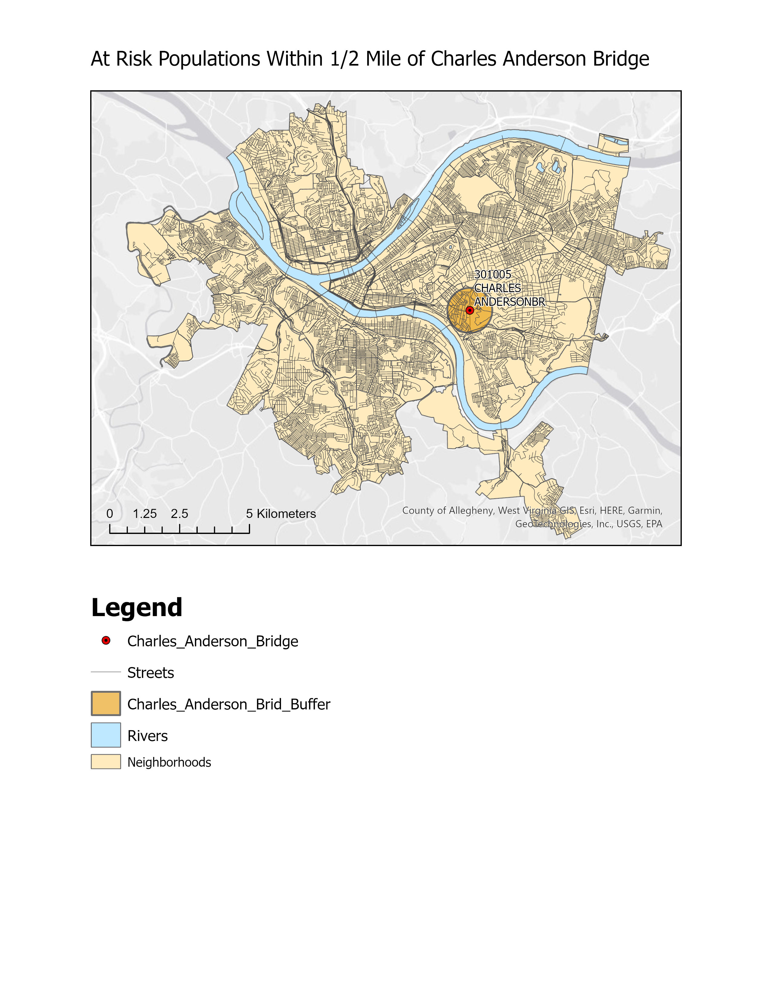

# Spatial Analysis: At-Risk Populations & Critical Infrastructure in Pittsburgh

  

## 📌 Project Overview
This GIS project analyzes the demographic distribution of vulnerable populations—specifically the elderly—in relation to critical infrastructure in Pittsburgh, Pennsylvania. The primary focus is assessing the potential impact of the **Charles Anderson Memorial Bridge (CAMB)** on surrounding communities, specifically looking at population density within a 0.5-mile radius.

This analysis is crucial for emergency planning, transit detours, and understanding the social equity implications of infrastructure maintenance or failure.

### 📷 Visualization

*Figure 1: Map showing the 0.5-mile risk buffer around the Charles Anderson Memorial Bridge relative to neighborhood block centroids.*

## 🎯 Objectives
* **Demographic Modeling:** Create a raster surface representing the density of the elderly population using Kernel Density estimation.
* **Proximity Analysis:** Delineate a 0.5-mile impact zone (buffer) around the Charles Anderson Memorial Bridge.
* **Risk Assessment:** Identify which neighborhoods and population clusters fall within the critical infrastructure buffer zone.

## 🛠️ Methodology
The analysis was conducted using **ArcGIS Pro**.

1.  **Data Ingestion:**
    * Imported Allegheny County street centerlines and bridge data.
    * Imported Census Block centroids with demographic data (Elderly population counts).
2.  **Kernel Density Estimation (KDE):**
    * Generated a continuous density surface (`Density of Elderly KD.tif`) to visualize the concentration of elderly residents.
    * *Technical Detail:* Used NAD83 / Pennsylvania South (ftUS) projection.
3.  **Buffer Analysis:**
    * Executed a geodesic buffer of 0.5 miles around the Charles Anderson Memorial Bridge to simulate an immediate impact zone for noise, construction traffic, or structural failure risks.
4.  **Cartography:**
    * Produced a finalized map highlighting the intersection of the risk buffer and high-density block centroids.

## 📂 Repository Structure
```text
├── Density of Elderly KD.tif       # Raster output: Kernel Density of elderly population
├── Density of Elderly KD.tfw       # World file for the raster georeferencing
├── GISLabQuiz.tbx                  # ArcGIS Toolbox containing project models/scripts
├── GISLabQuizVashishthDoshi.aprx   # Main ArcGIS Pro Project File
├── AtRiskCAMB0_5milebuffer.jpg     # Map Export: Visual output of the analysis
└── README.md                       # Project documentation
```
## 🚀 How to Use
1.  **Clone the Repository:**
    ```bash
    git clone [https://github.com/your-username/your-repo-name.git](https://github.com/your-username/your-repo-name.git)
    ```
2.  **Open the Project:**
    * Ensure you have **ArcGIS Pro** installed.
    * Double-click `GISLabQuizVashishthDoshi.aprx` to open the map and layout views.
3.  **View the Raster:**
    * If the path links are broken (common when moving GIS files), create a new connection to the folder containing `Density of Elderly KD.tif` and add it to the map.

## 🧰 Tools & Technologies, Specifics
* **Software:** ArcGIS Pro 3.x
* **Extensions:** Spatial Analyst
* **Coordinate System:** NAD 1983 StatePlane Pennsylvania South FIPS 3702 (Feet)

* **This was part of a deliverable** for a class taken at Carnegie Mellon University's Heinz College under Prof. Kurland.
